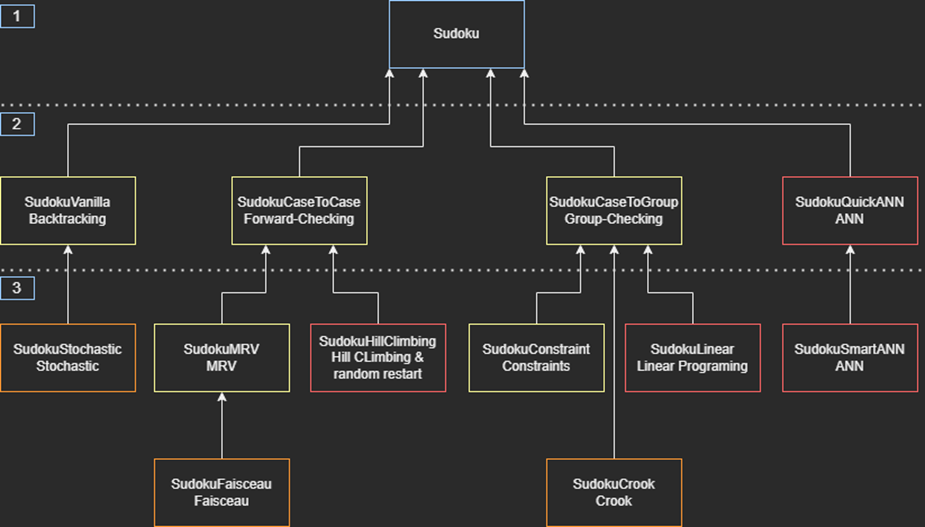
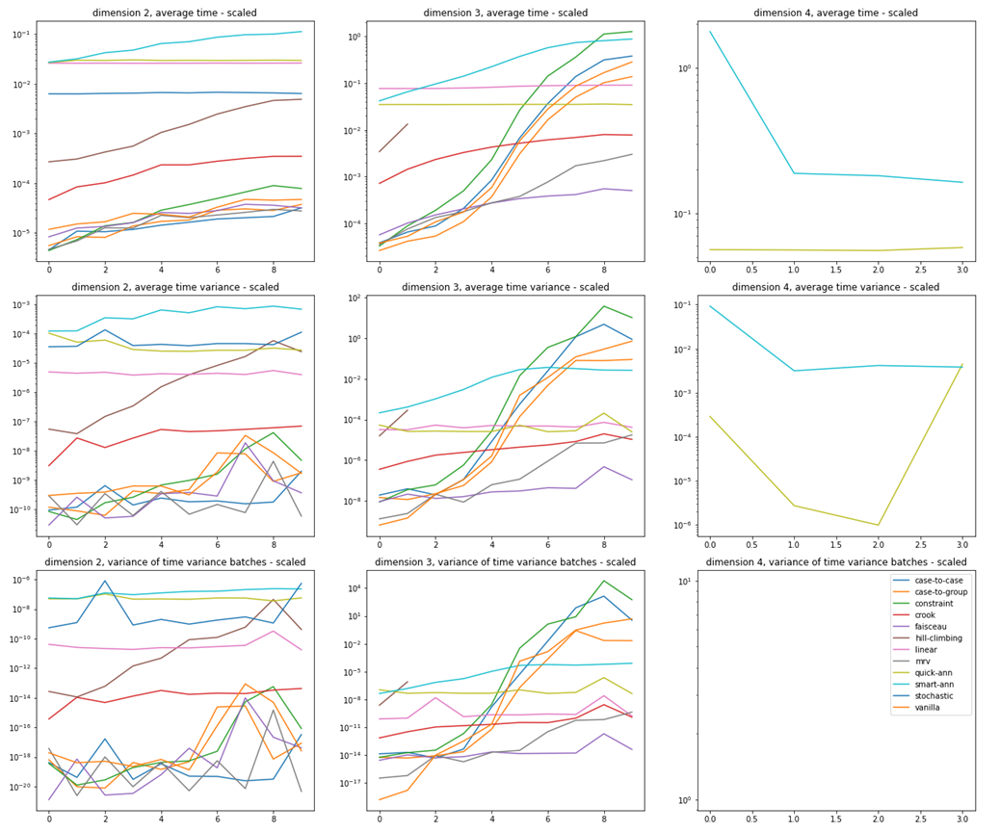
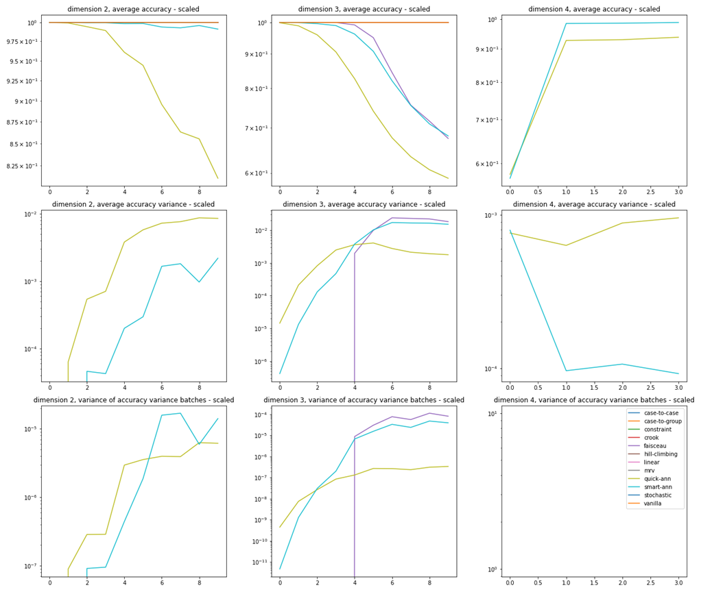

# Sudoku-AI-Solvers-Comparator

ESILV - PTS (Technical and Scientific Project) 2021/2022 with three contributors, done as part of the ESILV master's degree.


## Main Objective
- Conduct the state of the art on a given problem and compose a bibliography and a research report.
- Apply scientific knowledge and technical skills to understand a problem, design a solution and develop it.
- Plan a project and coordinate a team to carry out the STP. As the objective is to prepare for the professional world, it is essential to master the tools and techniques of project management and have a technical mastery.


## Motivation
The problem of solving the sudoku game is a classic to illustrate various complex algorithmic techniques. It is a good entry point to AI.

After some research on the methods of solving sudoku grids, it was pretty surprising that most publications on this subject did not pay attention to the performance of the algorithms implemented and privileged the latter's simplicity to the detriment of the deliberately sacrificed optimization. 

These choices are even more accentuated by using only one resolution method, named Backtracking, the most known and the simplest because of its closeness to human thinking in terms of solving sudoku grids. It is also recognized as one of the methods being the most
costly in terms of resolution time.
Thus, the latter were sometimes accompanied by its improvements, the same method of resolution of which heuristics were added thereafter for a slight optimization of the calculations and resolutions.

Consequently, the team unanimously wished to set up different resolution methods that will differ drastically from the most basic one, the Backtracking method, to evaluate various criteria and contribute thanks to this study to the discussion around the optimization of these methods.

We have determined which ones are the most optimal and fair in terms of the number of good cells found.


## Problematic
This project aims at studying the generation and resolution methods of selected grids. One of the most exciting problems is evaluating different resolution methods in terms of upstream criteria. At the end of these evaluations, it will be possible to determine which algorithmic philosophies are the most adapted to a Sudoku grid's resolution and determine the most efficient resolution model for a given grid.


## Material & Methods
### Algorithmic structure
Particular attention was paid to the architecture of the project and especially to the implementation of the different Sudoku models. 
This architecture also facilitates the automation and the generalization of model evaluation methods. Moreover, it is easy to adjust new models by basing them on an existing model. In general, it is enough to develop the new solving method by taking advantage of the optimizations and operations already created before.

### Resolution Methods
Below are the resolution methods implemented by the group:

- SudokuVanilla - Backtracking
- SudokuStochastic - Stochastic Exploration
- SudokuCaseToCase - Forward-Checking
- SudokuHillClimbing - Hill Climbing & Random Restart
- SudokuMRV - Minimum Remaining Values
- SudokuHuddle - Huddle Search
- SudokuCaseToGroup - Group-Checking
- SudokuConstraint - Constraint Search
- SudokuCrook - Crook Algorithm
- SudokuLinear - Linear Programming
- SudokuQuickANN - Artificial Neural Network (ANN)
- SudokuSmartANN - Artificial Neural Network



The Sudoku class is at the top of this tree in layer 1. It is where all the generic methods common to all models are located. The game grid is stored as a matrix. Layer 2 contains the classes that have a particular architecture, either in the way the game grid is stored or how the rules are implemented. Finally, in layer 3, the classes are based on a particular architecture of layer 2, distinguished by a unique resolution method.

The classes developed in phase 1, at the beginning of phase 2, and the end of phase 2 of the project are represented in yellow, orange, and red.
Each class thus presents a combination of representation of the game grid and a unique resolution method.

### Benchmark and Comparison Criteria
The implemented benchmark has several key steps in order to evaluate the implemented resolution methods. First, it is necessary to generate grids, fill the grids and then generate a latex report.
In order to generate the grids, the user must provide a generation model and rules, a list of dimensions, a list of difficulties, a quantity of grids to generate, a quantity of variants of the grid, the degree of these variants. A folder will be fed with binary files in .pickle format of the following form: "generator_name_dimension_difficulty_quantity_variants.pickle".

To evaluate the models, the user must enter a file name pattern to use in order to choose which types of grids to use, a list of models to evaluate, a list of rules. Another folder will also be fed with binary .pickle files of the form "batch_name_model_name_difficulty_variant_quantity.pickle".

This benchmark allows the generation of a statistical report of the evaluation, reporting the performance of each model (comparison criteria) in the form of a table and graphs. This is possible thanks to a class designed to generate a .tex file (LaTeX) and to convert it into a pdf file.

### Selected comparison criteria
The comparison criteria allowing the evaluation of the implemented resolution methods were decided during the setting up of the State of the Art at the beginning of the project (at the same time as the choice of the methods to be implemented).

These criteria correspond to :
- The average resolution time,
- The variance of the average resolution time,
- The variance of the variance of the implemented batches,
- The average precision (accuracy),
- The variance of the average precision,
- The variance of the variance of the implemented batches.

The selection of the resolution methods must allow comparing methods that are completely different from a programming point of view. It is just as important to compare two very different methods, even if the most efficient one is obvious, as two similar methods where the most efficient one is ignored.

This makes it possible to show how the way a method proceeds is not the right one for the case of Sudoku and that it does not allow to solve the problem efficiently. 


## Main Results
It is necessary to distinguish between different types of models when evaluating performance. The discriminating criterion will be the execution time for those that consistently produce an excellent grid, while the percentage of valid grids will be more important for the others. We can also notice that the results presented below were obtained with the Pypy interpreter instead of the classic Python3 interpreter. Finally, the results have been scaled logarithmically.
A batch corresponds to the performance evaluation on a given grid and all its variants.
Other results are in the "repoting" folder.





It is essential to avoid randomness to efficiently solve a problem with as many possible combinations as Sudoku. Therefore, it is preferable to use a more optimized architecture than the simple matrix representation. It is possible to make calculations to optimize the choice of the Boxes or the Moves at each step of backtracking to avoid getting lost in the search space. In the case of dimension three grids, the MRV will be best for grids with at least twenty indices, below which Crook will be more reliable. Only neural networks can be useful for grids of dimension four and more, but they will never provide correct results.


# How to use
Please install firstly the requirement:

``` pip install -r requirements.txt ```

You can use a web application that we have implemented to:
- Play a Sudoku game (by choosing the model, the rules, the dimension of the grid) and viewing the solution,
- It is also possible to change the region map.

To do so, you need to run the ```app.py``` process and click on the link generated.

To launch a benchmark, you need to run the function "main_bechmark". You can modify some parameters in it.


